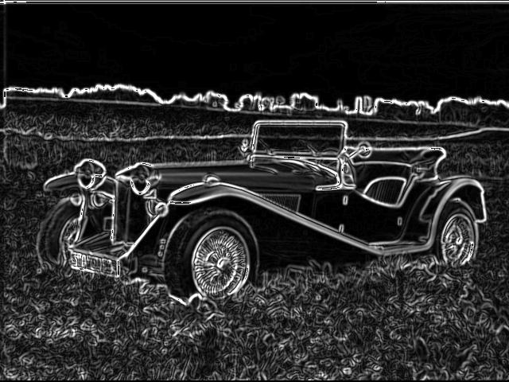
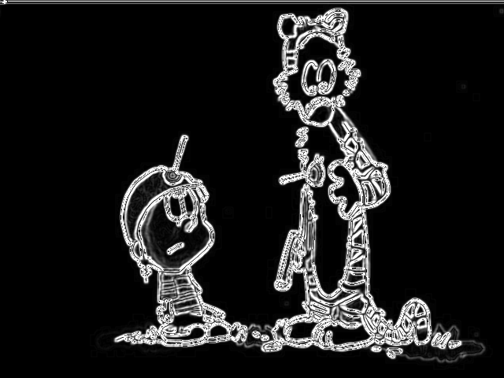
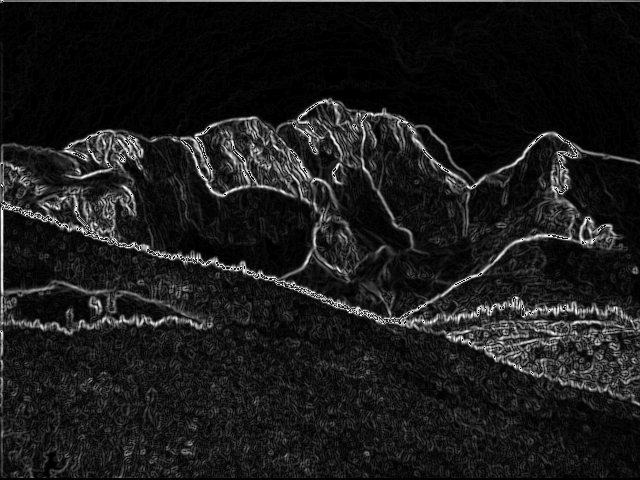

# SobelFilter

UART-streamed Sobel edge detection pipeline for iCE40 UP5K FPGA. Image data is transmitted over serial, processed on the FPGA, and streamed back as edge-detected output.

## Processing Pipeline

  UART RX
  8-to-24-bit byte packing
  RGB to grayscale conversion
  3x3 Sobel convolution
  3x3 Gaussian convolution
  Gradient magnitude calculation
  UART TX

## Project Specifications

Target Device: Lattice iCE40 UP5K

Logic Cells: 1912 out of 5280 used (36%)

Block RAM: 25 out of 30 blocks used (83%)

Maximum Frequency: 35.29 MHz (30 MHz core clock)

Timing Margin: 5.29 MHz above target

Clock Source: 12 MHz external oscillator via PLL

Core Clock: 30 MHz (PLL multiplied 2x, divided by 1)

## Design Features

Elastic pipelining in convolution and magnitude stages for timing optimization
Synchronous FIFO for input/output buffering
Circular line buffer for efficient 3x3 window management
Gaussian matrix blur for noise reduction
Handshake protocol for rate-decoupled data flow

## Critical Path Analysis

The synthesis report identifies a single critical path in the UART TX prescaler divider logic.

## Example Outputs

car.jpg

comic.jpg

mountain.jpg

